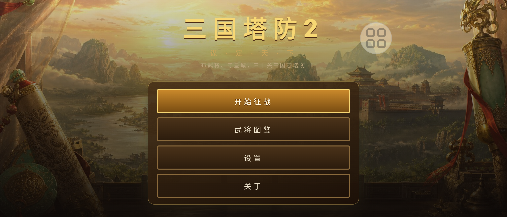
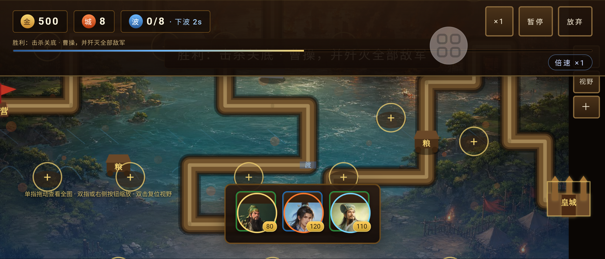
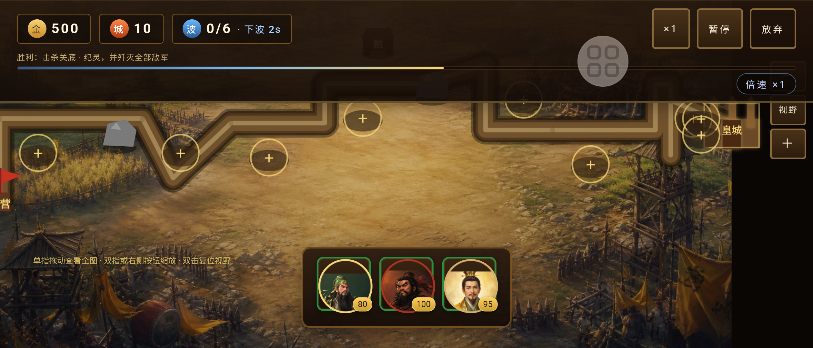
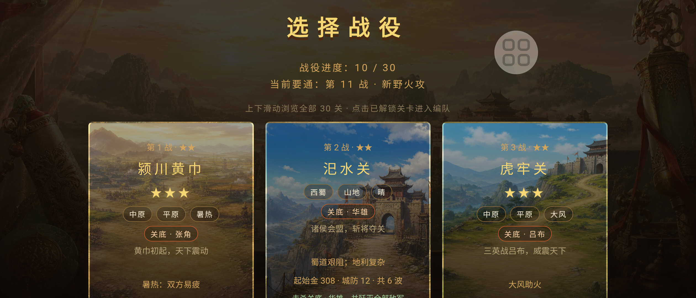

# 三国塔防

单机三国题材塔防（Android / WebView + Canvas）。布武将、守皇城，30 关战役；武将升级、合成、怒气大招。

**万万. 活着就是玩工作室** · 仓库：[wanwanlaoer](https://github.com/ThomasWan123/wanwanlaoer)

## 功能概览

- 30 关战役，本地 `localStorage` 存档
- 折叠屏外屏 `fill-pan` 镜头与单指平移
- 新手引导、设置（画质 / 音效 / 自动大招）、通关星级
- 手绘国风美术资产（立绘 / 地图 / 主菜单，见 [docs/ART_PLAN.md](docs/ART_PLAN.md)）+ 程序绘制兜底
- 可玩将：关羽、张飞、刘备、赵云、诸葛亮、吕布、周瑜、鲁肃、**曹操**、**孙权**（战役里程碑解锁）

## 截图

| 主菜单 | 赤壁战斗 |
|--------|----------|
|  |  |

| 小沛据守 | 选关 |
|----------|------|
|  |  |

真机刷新：`node tools/device-acceptance.mjs` → `.\tools\prepare-play-store-assets.ps1`（同步 `docs/play-store/` 与 `docs/screenshots/`）。

## 构建

需要 **JDK 11+**。

```bash
cd AndroidVer
.\gradlew.bat assembleDebug          # 调试包
.\gradlew.bat assembleRelease        # 内测 / 发布包（app-release.apk）
.\gradlew.bat verifyApkAssetsParity  # 校验 debug/release 游戏资源一致
```

输出：

- Debug：`app/build/outputs/apk/debug/app-debug.apk`
- Release：`app/build/outputs/apk/release/app-release.apk`

详见 [docs/BUILD.md](docs/BUILD.md)。

## 内测安装

见 [docs/BETA.md](docs/BETA.md)。**勿安装** `app-release-unsigned.apk`。

## 文档

| 文件 | 说明 |
|------|------|
| [docs/BUILD.md](docs/BUILD.md) | 环境、签名、AAB |
| [docs/BETA.md](docs/BETA.md) | 内测分发 |
| [docs/ROADMAP.md](docs/ROADMAP.md) | 路线图 |
| [docs/ART_PLAN.md](docs/ART_PLAN.md) | 美术升级计划 |
| [docs/RELEASE.md](docs/RELEASE.md) | 上架与版本发布 |
| [TESTING.md](TESTING.md) | 真机回归清单 |
| [../IOSver/docs/TESTING-IOS.md](../IOSver/docs/TESTING-IOS.md) | iOS 真机回归清单 |
| [PRIVACY.md](PRIVACY.md) | 隐私说明 |

## 许可证

[MIT License](LICENSE).

## 持续集成

推送至 `main` / `master` 时，GitHub Actions 会执行 `assembleDebug`、`assembleRelease`、`verifyApkAssetsParity`，并上传 **Release APK** artifact（见 [.github/workflows/android.yml](.github/workflows/android.yml)）。

## 路线

内测 → 体验打磨（平衡/地图/UI）→ 新将 → Google Play。见 [docs/ROADMAP.md](docs/ROADMAP.md).
